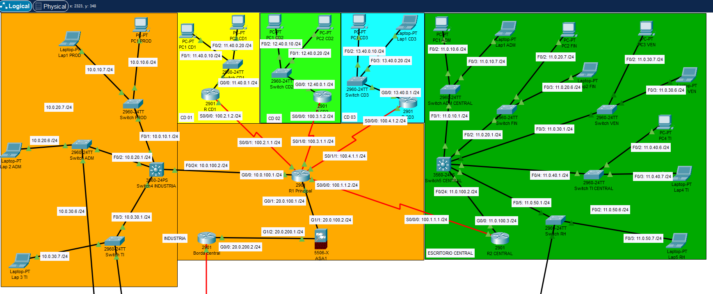
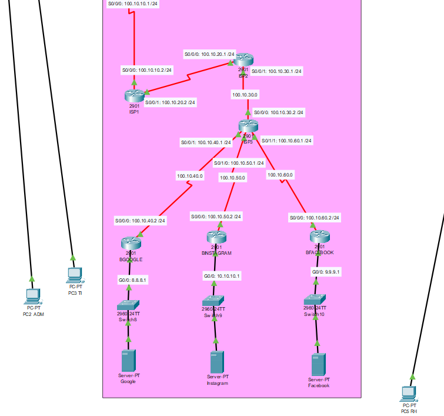

# 🏭 Infraestrutura de Rede Corporativa - Indústria & Matriz

Simulação de arquitetura de redes de alta disponibilidade e segurança utilizando Cisco Packet Tracer.

## 📋 Sobre o Projeto

Este projeto consiste no design e implementação de uma infraestrutura de rede complexa que conecta uma **Indústria**, um **Escritório Central (Matriz)** e serviços em **Nuvem**. O objetivo foi simular um cenário real de comunicação corporativa.

O cenário abrange desde a configuração de VLANs e roteamento inter-VLAN até a implementação de segurança de borda com Firewall ASA.

---

## 🛠️ Tecnologias e Protocolos

As seguintes tecnologias foram configuradas e validadas neste laboratório:

* **Roteamento:** OSPF (Multi-area/Single-area) e Rotas Estáticas.
* **Switching (L2/L3):** VLANs, Trunking (802.1q) e VTP (VLAN Trunking Protocol).
* **Segurança:** Cisco ASA 5506 Firewall (Inspeção de tráfego) e ACLs.
* **Serviços de Rede:** DHCP Server (Centralizado no roteador), DNS e Web Server (HTTP).
* **WAN:** Links Seriais conectando filiais e simulação de ISP (Internet Service Provider).

---

## 📍 Topologia da Rede

### 1. Visão Geral (Lógica e Física)
A rede é dividida em dois grandes blocos corporativos conectados via WAN:

* **Indústria (Esquerda):** Focada em produção. Utiliza Switches L2 para conectar os setores (Produção, ADM, TI). Possui proteção de borda com **Firewall ASA 5506** antes de sair para a internet.
* **Escritório Central (Direita):** Utiliza um **Switch L3 (Core)** para roteamento rápido entre departamentos (Finanças, RH, Vendas, TI).

### 2. Simulação de Nuvem e Internet
Para validar a conectividade externa, foi simulada uma infraestrutura de nuvem com roteadores de ISP e servidores de serviços reais (Google, Facebook, Instagram), garantindo que as regras de NAT e Roteamento estejam funcionais.

---

## 🚀 Funcionalidades Implementadas

* **Segmentação de Tráfego:** Cada departamento possui sua própria VLAN e sub-rede IP, isolando o tráfego de broadcast e aumentando a segurança.
* **Segurança de Perímetro:** Todo o tráfego da indústria passa obrigatoriamente pelo **ASA Firewall** antes de atingir o roteador de borda.
* **Automação:** Os hosts recebem endereçamento IP automaticamente via DHCP configurado nos roteadores.
* **Acesso Externo:** Simulação de acesso a servidores web externos para testes de conectividade e resolução de nomes.